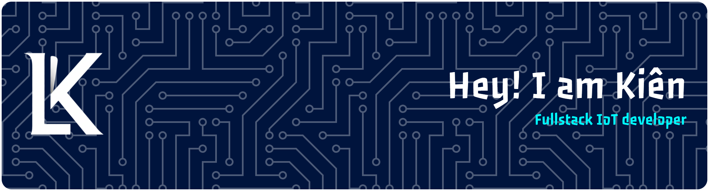

  

  

  

  

  

# About Me
<ul >
  <li>Computer Networks & Data Communications Student in <a href="https://uneti.edu.vn/" target="_blank">University of Economic and Technical Industries (UNETI)</a></li>
  <li>Enjoy building beautiful UI website/application and creating smart Iot project.</li>
  <li>I'm in the process of learning English so I always use English everywhere athough it's not always correct.</li>
  <li>Hobbies: Time Fight Tactics, Code with AI.</li>
</ul>

            

<b>🏅 My Badge</b>

 

## 🏆 GitHub Trophies

  

---

# 💻 Top Languages

  

<h3 align="center" style="margin-top: 20px;">@letrungkien</h3>

---

